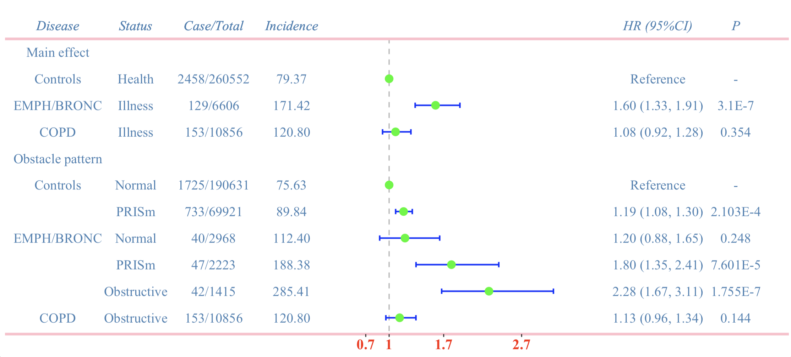

## Introduction
- 一个快速绘制漂亮简洁森林图的R包，功能易用，中文注释
- 返回一个 `ggplot2` 对象，建议通过 `eoffice::topptx()` 输出后使用PowerPoint进行额外美化
- 我为它取了一个好听的函数名 `forestify()`

## Installation
```R
# 若希望直接更新该R包，则在未加载 FORESTPLOT.PAC 的基础上直接运行下方代码即可
devtools::install_github("yuanlinm/FORESTPLOT.PAC")
library(FORESTPLOT.PAC)

```

## Quick start

```R
forestify(df = df,left_side_cols = c(1:4),
      right_side_cols = c(11:12),
      estimate = 'HR',
      lower = 'HR_lower',
      upper = 'HR_upper')
```

## Visualization



## FULL parameters

```R
# FULL usage
forestify(df = df,left_side_cols = c(1:4),right_side_cols = c(11:12),estimate = 'HR',lower = 'HR_lower', upper = 'HR_upper',
          bar_scale = 1, h_scale = 0.07,gap_value = 0.05,x_limit = c(0.7, 3.5),x_step = 1,x_text_size = 14,x_text_color = 'red',
          x_text_face = 'bold',box_shape = 20,box_size = 5,box_color = 'green',bar_width = 0.2,bar_size = 0.7,bar_color = 'blue',
          ref_line_type = 'dashed',ref_line_value = 1, ref_line_size = 0.6,ref_line_color = 'gray',col_name_face = 'italic',
          col_line_type = 'solid', col_line_color = 'pink', col_line_size = 1.2, low_line_type = 'solid', low_line_color = 'pink',
          low_line_size = 1.2, text_size = 4.6, text_color = 'steelblue', text_family = 'Times New Roman',
          p_value_col = 'P', p_value_round = 3, round_cols = c('Incidence', 'HR (95% CI)'), round_digit = 2)


# Parameter Explanation
#' @param df dataframe 用于绘图的总数据集，必须提供
#' @param left_side_cols num_vector，用于展示在森林图左侧内容的列号
#' @param right_side_cols num_vector，用于展示在森林图右侧内容的列号
#' @param estimate chr，列名，指定森林图box的值，例如beta/OR/HR等
#' @param lower chr，列名，指定森林图box的error bar 下限
#' @param upper chr，列名，指定森林图box的error bar 上限
#' @param bar_scale num，调整森林图box的error bar整理宽窄，默认为1
#' @param h_scale num，调整森林图水平方向的整体宽窄，默认为0.08
#' @param gap_value num，调整图形部分和文字部分的间隔，默认为0.4
#' @param x_limit num_vector，长度为2，指定x轴显示的上下限，默认为0.8 to 3.2
#' @param x_step num，指定x轴坐标的值的步进，默认为0.5
#' @param x_text_size num，指定x轴文字大小，默认为12
#' @param x_text_color chr，指定x轴文字颜色，默认为black
#' @param x_text_face chr，指定x轴文字是否加粗，默认为NULL，设置为bold则加粗
#' @param box_shape num，指定box的形状，默认为15
#' @param box_size num，指定box的大小，默认为4
#' @param box_color chr，指定box的颜色，默认为black
#' @param bar_width num，指定error bar的ticks长度，默认为0
#' @param bar_size num，指定error bar的粗细，默认为0.5
#' @param bar_color chr，指定error bar的颜色，默认为black
#' @param ref_line_type chr，指定参考线的类型，默认为dashed
#' @param ref_line_value num，指定参考线的位置，默认为1
#' @param ref_line_size num，指定参考线的粗细，默认为0.5
#' @param ref_line_color num，指定参考线的颜色，默认为black
#' @param col_name_face chr，指定纵标目是否加粗，默认为bold，其他为plain/italic
#' @param col_line_type chr，指定标目线的类型，默认为solid
#' @param col_line_color chr，指定标目线的颜色，默认为black
#' @param col_line_size num，指定标目线的粗细，默认为0.5
#' @param low_line_type chr，指定x轴线的类型，默认为solid
#' @param low_line_color chr，指定x轴线的颜色，默认为black
#' @param low_line_size num，指定x轴线的粗细，默认为0.5
#' @param text_size num，指定全局文字的大小，默认为4.5
#' @param text_color chr，指定全局文字的颜色，默认为black
#' @param text_family chr，指定全局文字的字体，默认为Arial
#' @param p_value_col chr，指定P值列的列名用于对P值进行round，默认为NULL，若指定则p_value_round不能为空
#' @param p_value_round num，指定P值列round保留小数位数，，默认为NULL，若指定则p_value_col不能为空
#' @param round_cols chr_vector，字符串向量，指定需要round的列名，默认为NULL，若指定则round_digit不能为空
#' @param round_digit num，指定round列保留小数位数，，默认为NULL，若指定则round_cols不能为空

```
